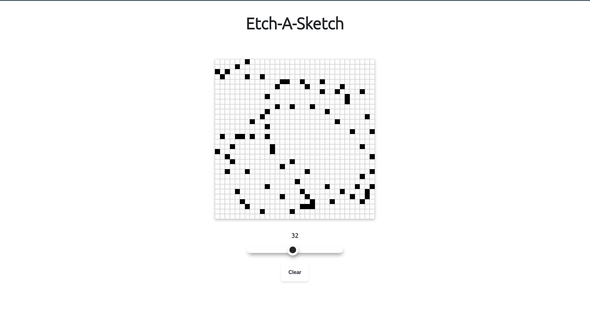

# Etch a Sketch Project

  <a href="https://joao4xz.github.io/odin_etch-a-sketch/">Live Preview</a>

"The Odin Project" Etch A Sketch project.

This project have the purpose of using DOM manipulation skills and all of the other things learned before (HTML, CSS and basics of JS).
